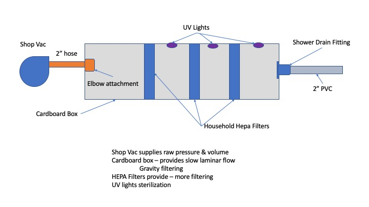

# Experiment 1:
Can we build a box that can filter the air from a shop vac from Home Depot

Format: ! Overall Diagram showing notional layout
---------
# Hypothesis 1:
We can build a box that will provide laminar flow through the volume so gravity can filter larger particles, and HEPA / nice filters can do the job

## Build - 1
Single Stage Filter box

Format: ![Picture showing parts used ]

Shop vac input -- box -- 16x20x4 filter -- box -- 2" output
* AirBoxExperiment_1.jpg shows supplies used
* AirflowBox.jpg show concept for multi-stage.
* FilterInstall.jpg shows putting the filter in the middle of two boxes
* Input/Output.jpg shows installing the in/out fittings.

Functionally tested system Air blows through fine -- no significant pitch change in shop vac. Shop vac has filter and bag installed.

# Hypothesis 2:
Shop Vac can push enough air through filter-box without loading the vac significantly.

## Build - 2
Build simple manometer for input and output
