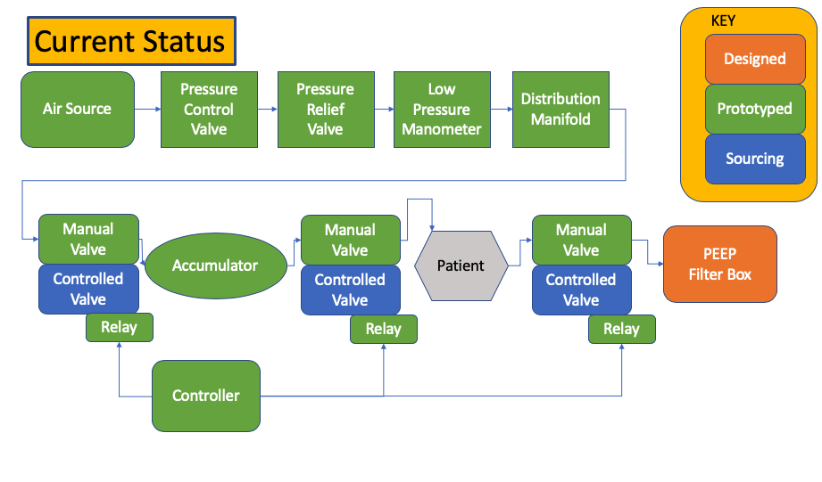

# [Simple Open Ventilator](System/README.md)

**Lawyers: This project is to demonstrate the possibility**


-----
# **Update**
Most of the system running.
Current configuration has an Arduino with a relay running the control circuit. The circuit is really simple and can be assembled many ways.

* Current issue --
* Washer 120v solenoid actuated valve works fine with the duty cycle, but is just way too small. This could be overcome with adding pressure (Voltage and pressure are similar). And the orifice in the valve is equivalent to resistance, but then the working air pressure is not-patient safe.

# Two non-HD parts currently
* Controller Circuit
  \- Can be build easily enough PWM signal.
* Electrically Controlled Valve
  \- Electric over hydraulic valves should work. Not at HD, but locally acquirable. From all sorts of hydraulic / farm systems.


The goal of this project is to demonstrate that a complex ventilator is possible to build with nearly all hardware store parts. We are actually building one that can be demonstrated and tested. We are documenting our efforts here.

What does a ventilator need to do in the simplest case. It needs to gently push air to lungs and assist with exhale. We can do this with a constant pressure source, a few valves, and the Venturi effect. We will not be worried about noise or efficiency.

The diagram below shows the Fill and Exhaust states. During the Fill state a valve opens (V1) filling the balloon. During the next state, V1 closes and V2 opens.

#**NEED DOC CLARIFICATION**

## Concept v2 : v1 was incorrect
If the a positive pressure is applied inside the chest cavity ie. blood, injury or other. then the normal range of motion is impeded. An output pressure regulator (PEEP valve) is needed to keep a slight positive pressure to overcome during exhale.




# Technical Constraints
We have limits on the total volume, Respiration rate, and max pressure that can be applied to the balloon. The medical industry uses terms of art we need to convert to more traditional engineering terms.

**Tidal Volume** -- Volume of air that needs to be pushed and pulled out of the balloon: 400-700mL. This is a reasonable amount. We can figure this out.

**Pressure mmHg** -- Standard pressure measurement, but we like to work in PSI.
40mmHg == 0.77PSI. This is too small for our normal measuring tools. We need a way to work with this. Mercury is hard to get and poisonous, we will use water.
1mmHg = 0.535776 inH2O, or about 1.3cmH2O very doable and easy.

**Respiration Rate** -- Fill, wait, exhaust cycles. We call this hysteresis. Simple control problems. 5-30 breaths per minute.

# Tunable values
* Tidal Volume 400mL to 600mL
* Respiration Rates 5-30 cycles/min
* Pressure 40mmHg to 60mmHg (21.4 inH2O --> 32 inH2O = Delta 10.6 inches)

# Construction Constraints / Mission
We know we can spend money and time to make very nice ventilators. What can we do when we need many more than can be manufactured in a hurry? Can we leverage local tradesman talent and supplies? If we assume our normal scientific supply chain is broken or too slow we have to move to distributed manufacturing with what is in stock. Our group is taking the Apollo 13 approach. What is available in the local stores, and what can local craftsmen construct? Can this be completed with all in stock parts from a local hardware store?  

# Tasks:
* **Create a system absolutely as simple as possible**
* Create a constant low pressure high volume air supply
* Create Safety system to reduce injuries
* Create measurement system
* Develop and Test Prototype System
* Document prototype system

-----------
#Progress of current build out. Not a lot of software, it is Physics based.
 [Current Progress](System/README.md)


----------
# Disclaimer
Due to liability issues
**No warranty of usefulness at all**
# License
Until we get further guidance the project is licensed as such:
* CERN Open Hardware Licence Version 2 - Permissive [license](Documents/license.md)

# Donations
If you want to donate to the project you may donate to a developer directly for parts etc:
```
BTC: 12VbmzcMsj5VtiCuqSdMPihkLPt9UEqHfd
```

Or you can done to a 501(c)3
**The Asymmetrical Biodiversity Studies and Observation Group**
[(ABSOG)](https://threesecondsuntilmidnight.com/absog/)
They are working on a direct donation page.


# Why are we doing this?
COVID-19 has exposed a critical shortage in our medical care capabilities, and supply chain. (REF Italy doc report). Throwing money at the vendors to produce more and faster is unlikely to work in serious world-wide pandemic where supply-chains are shut down, the need for ventilators vastly outstrips the manufacturing capability, or quarantine simply shuts down transportation.


The total number of ventilators available is around 600-800k(1). Of the total ventilators 80% are currently in use for car accidents, surgery recovery, etc. Even if we had 1M and 20% avail that only leave 200k avail. The CDC is predicting over 1M dead in one model. These people might live if ventilators were available. We think we can help, and it is our duty to help. We don't want doctors and nurses having to choose who lives and who dies in the emergency room based on the number of ventilators available.


(1) Based on off the record conversations with USG officials.

# Mission Statement
Henry Watt from Britain during WW2 said --

**'''Watt: The system was deliberately developed using existing commercially available technology to speed introduction.[60] The development team could not afford the time to develop and debug new technology. Watt, a pragmatic engineer, believed "third-best" would do if "second-best" would not be available in time and "best" never available at all. -- quote from wikipedia
'''**

# What we have volunteering part time
- Doc reviewing our effort
- Senior Hydraulic Engineer
- Master Fabricator
- Senior Electrical Engineer

# What we need
- Documentation help
- Fabrication duplication
- Imagineers / Fabricators
- Nurses / PA's
- Makers to help
- Funding for parts & help


# System Diagram
- Diagram is incomplete. Needs reviewing


Test edit
