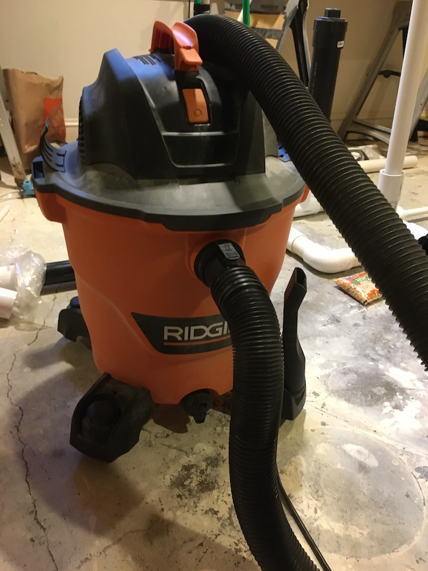

# Air Source
-------------

Requirements for the air source is that it delivers sufficient air pressure and
volume to drive the system.

-----------------
# Total Tidal Volume Calculations

| Breaths per minute  | Tidal Volume  | L / min |
|---------------------|---------------|---------|
|        5            | 400mL - 0.4L | 2.0L / min|
|        5            | 700mL - 0.7L | 3.5L / min|
|        12           | 400mL - 0.4L | 4.8L / min|
|        12           | 700mL - 0.7L | 8.4L / min|
|        40           | 400mL - 0.4L | 16.0L / min|
|        40           | 700mL - 0.7L | 28.0L / min|

The current Air source is a 14 Gal Shop Vac It has plenty of Pressure and Volume

