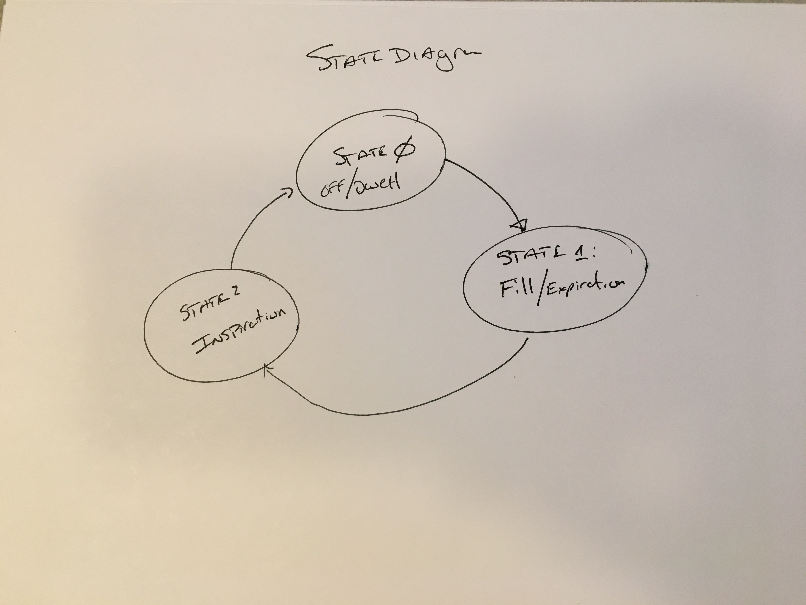
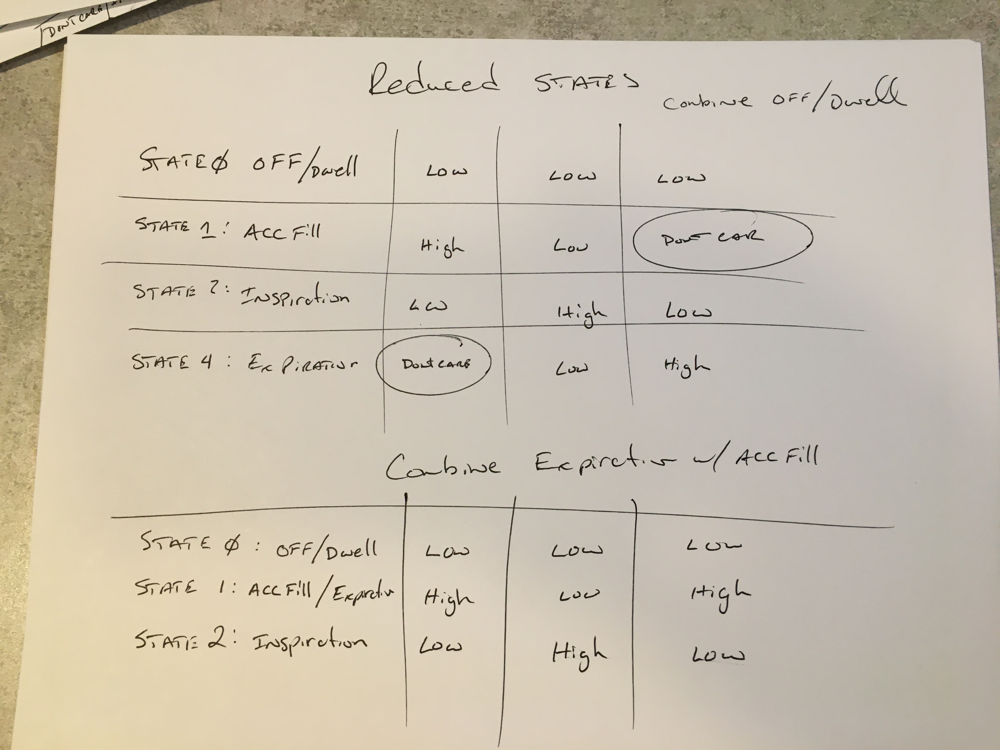
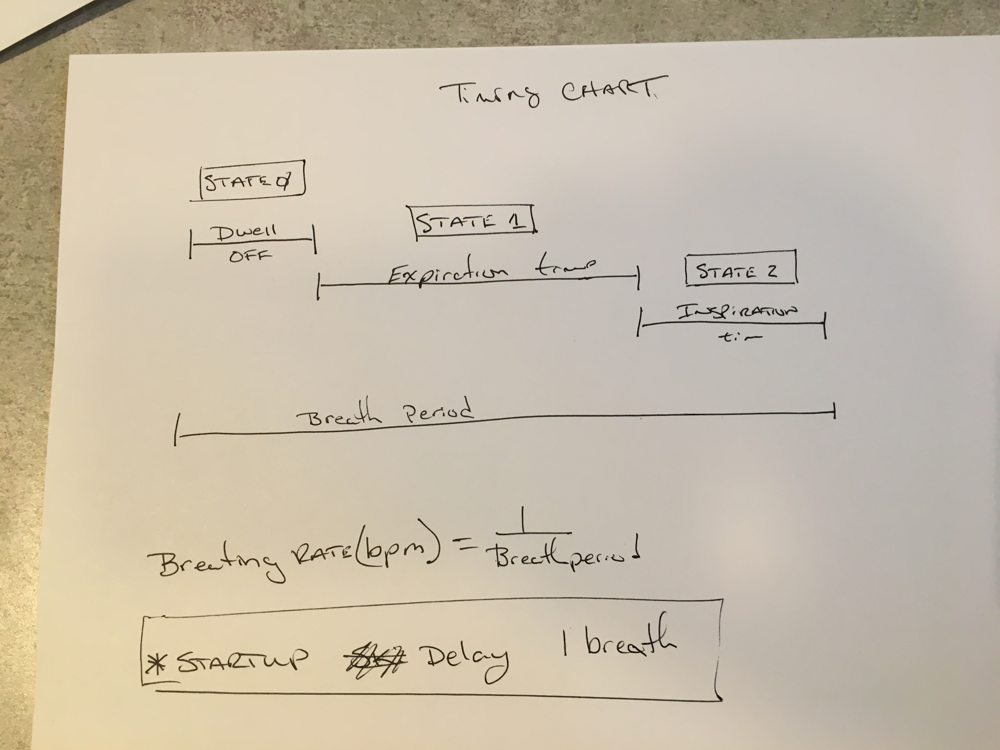

# **Electromechanical Control systems**
-----------
The System is driven by a very simple control system.

# Mechanical
3 Valves

# Electrical
1 arudino uno
3 relays

---------------
# Current State:
Control circuit timing is fixed currently. Can be changed by uploading new code with updated constants

# TODO:
* Add 2 Potentiometer inputs to vary Pulse width and Period
* Add display showing timing for each
* Add safety stops for out of bounds
