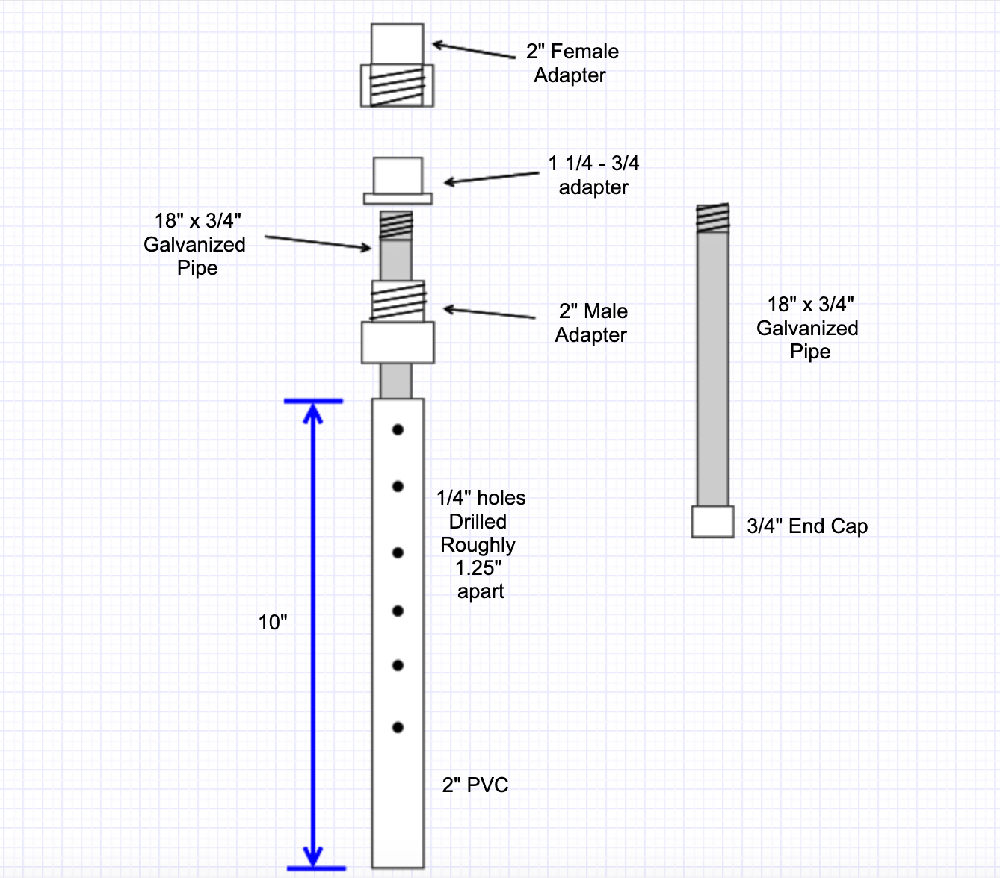

# Pressure Control Valve

**Current Version 3.0**

## Current Design

## Concept
Gravity, air pressure can equal out. If the air flow can leak out we can maintain a certain pressure with balance. The air flowing up a standpipe and out the hole has a certain force over a given area. If we place a weight that has a tiny bit less force with gravity as the air has pressure going up, the weight will begin to float. Enabling us to calculate the air pressure.

We are moving from theoretical to practical. We have too many unknowns to fully calculate the absolute correct mass, but we did just build a [Low Pressure Manometer](System/LowPressureManometer/README.md). We know from <calculation reference> that our approx weight desired for a pressure of 40mmHg is about 2.5lbs. So We are going to build the following.

Then put this on a 4' vertical 1.5" PVC Stand Pipe.

When you turn on the shopvac the first time, expect the weight assembly to go flying. You are going to need to decrease the resistance for the escaping air.
Start with drilling 1/4" holes about an inch down from the bottom of the coupler.

This is where we begin difference measurements. You have to have the manometer already built and in place. You are going to adjust the length of the pipe and the holes to get the desired inH2O measurement.

## Conversion values
*1 inH2O = 1.866463mmHg*
*1 cmH2O = 0.734824mmHg*

## Observations
You will notice the Manometer sloshing about depending on the load.
Remember 1" is less than 2mmHG. 2" is less than a 10% variation, AND the AMBUBAG is regulating what the patient sees. Fluctuations in the primary system should never be transferred to the patient.

## Notes

## *Update*
Pressure control valve success today (16 Mar 20). maintained 24" with a 1/2 hole wide open. Weight based option worked. We had to add orifaces in the side of the cap to reduce the escape air resistance.

## Theory:
< insert better explanation >

The pressure control valve and monitoring system is critical to the design operating as intended. The pressure controls the system and fills the accumulator that helps the patient breathe. So over-pressurization is bad but not terrible.

## Version 3 / Experiment 3
Slight changes in design to make changing weight easier, and more controlled hole drilling for airflow exit. Confirmed working with globe valve, manometer, and mark 1 eyeball. TODO: Post newest Desigs.

## Verison 2 / Experiment 2

## Version / Experiment 1
The design has undergone the first iteration.
The original proposed design
[Original sketch](System/RawDesigns/pressurecontrolsketch.jpg)
[Drawing](System/RawDesigns/pressurecontrol_drawing.jpg)
The monitoring system
[As Drawn 2](System/RawDesigns/psv_m_sketch.jpg)
[As Drawn 2](System/RawDesigns/psv_m_drawing.jpg)
