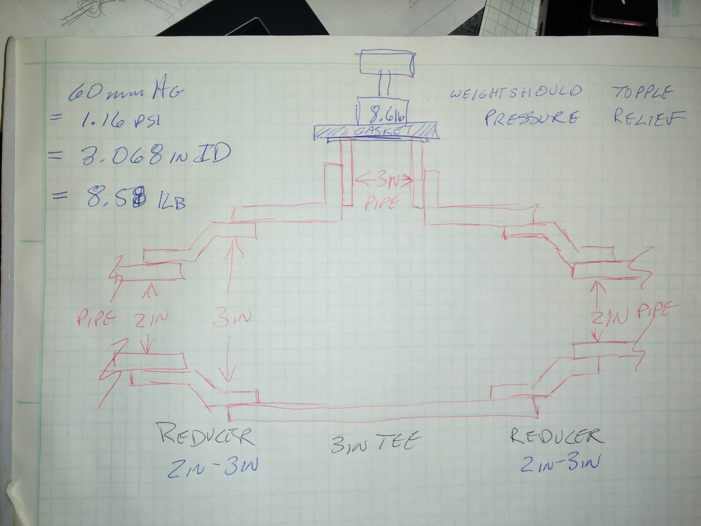

## Pressure Relief Valve
Basic gravity pressure relief valve. When overpressure occurs, the lid tilts knocking the weight off and opening the line to ambient air. Valve tilted at a 10degree angle to ensure proper operation.

**TODO: Document and Test**

### Version 2

### Version 1
OBE
