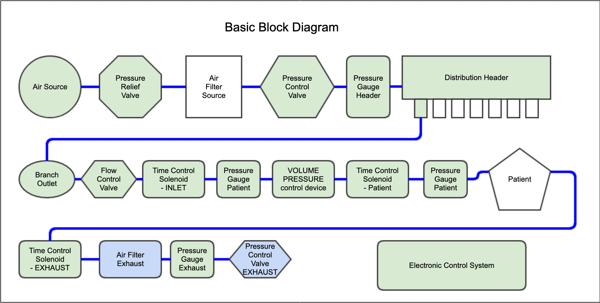

# Simple Open Ventilator

**Lawyers: This project is to demonstrate the possibility**

**Goal: Build a demonstration ventilator with as many locally available parts as possible**

Our [Main Page](../README.md) has the overall description and mission. These are describes the actual buildout of the system.

# Overall System Design
**System Diagram**
**Under Development -- Not accurate yet**
More [Diagrams](Diagrams/README.md) under development

[Word Document](System/COVIDventv3Seldon.pdf)

# Major Blocks of the Design
**Note: some of these links are not complete yet**
| Component|Design Status|Prototype Status|
|---|---|
|[ **Air Source** ](AirSource/README.md)| Complete|Complete|
----
|[ **Pressure Relief Valve**](PressureRelief/README.md)|Complete|Testing|
---
* [ **Air Filter Source**](AirFilter/README.md)
* [ **Pressure Control Valve**](PressureControlValve/README.md)
* [ **Pressure Gauge Header**](LowPressureManometer/README.md)
* [ **Distribution Header** ](Distribution/README.md)
* [ **Branch Outlet**](Distribution/README.md)
* [ **Flow Control Valve**](Distribution/README.md)
* [ **Time Control Solenoid -INLET**](/Valve/README.md)
* [ **Pressure Gauge - Patient** ](/LowPressureManometer/README.md)
* [ **VOLUME/PRESSURE Control Device](/PACMAN/README.md)
* [ **Time Control Solenoid -PATIENT**](/Valve/README.md)
* [ **Pressure Gauge - Patient** ](/LowPressureManometer/README.md)
* [ **Patient -- Specifcations**](/Patient/README.md)
* [ **Time Control Solenoid -EXHAUST**](/Valve/README.md)
* [ **Air Filter Exhaust**](/AirFilter/README.md)
* [ **Pressure Control Valve - PEEP**](/PEEP/README.md)
* [ **Electronic Control System**](/Controls/README.md)
---------
# **Ventilator Station -- Design Requirements**
* \- *Tidal Air Measurement and Delivery*
* \- *Respiration Rate*
* \- *Tidal Air Removal*
* \- *Tidal Air Filtration*

---------
# **Test and Measurement**
* [Tidal Volume](TestMeasurement/README.md)

# [Air Source](AirPressureDelivery/README.md)
We need air pressure to run the system and to provide venturi for exhale filtering.
* **Version 1 Built**

# [Air Filtration](AirFilter/README.md)
We need air pressure to run the system and to provide venturi for exhale filtering.
* **Version 1.0 Built tested, Failed**
* *Version 2.0 Based on wooden Crate*

# [Pressure Measurement Tool](LowPressureManometer/README.md)
The Low Pressure Manometer is the critical enabling design element, without this very simple measurement tool, you are just guessing. Measurements simple and taken with yardstick / meter stick. We can measure .47mmHg with a 1/4" or .37mmHg with 0.5cm. This is because H2O is much less dense than Mercury (Hg).
* **Version 3.0 Tested, built and documented**

# [Pressure Control Valve](PressureControlValve/README.md)
Responsible for the overall system pressure regulation. Simple design based on gravity and a leaky regulator.
* **Version 3.0 Built, tested, TODO: Document**

# [Pressure Relief Valve](PressureRelief/README.md)
Responsible for overpressure protection. Fails in the OPEN position, meaning entire system pressure drops to ambient. Assumes a critical failure requires immediate attention.
* **Verision 1.0, Built,  *Testing underway***

# [Air Pressure Distribution](PressureDistribution/README.md)
* **Version 1.0 Built, in use, TODO: Document**

# [Individual Air Station](IndividualDistribution/README.md)
* **Version 1.0 Designed TODO: Build, Test, Document**
# [Ventilator Station](Ventilator/README.md)

* \- *[Tidal Air Measurement and Delivery](Ventilator/TidalAirIN/README.md)*
      **Recieved Ambu+ bag in mail, Discovery TODO: lots**

* \- *[Respiration Rate](Ventilator/RespirationRate/README.md)*
      **RC bi-stable multi-vibrator with Relays and solenoids**

* \- *Peep Valve
      A valve that keeps the lungs at max exhale slightly higher pressure than ambient. To keep lungs fully inflated and keep from collapsing.

* \- *[Tidal Air Removal](Ventilator/TidalAirOUT/README.md)*
      **Venturi Effect**

* \- *[Tidal Air Filtration](Ventilator/TidalAirFilter/README.md)*
      **Filter in a box with UV light**
