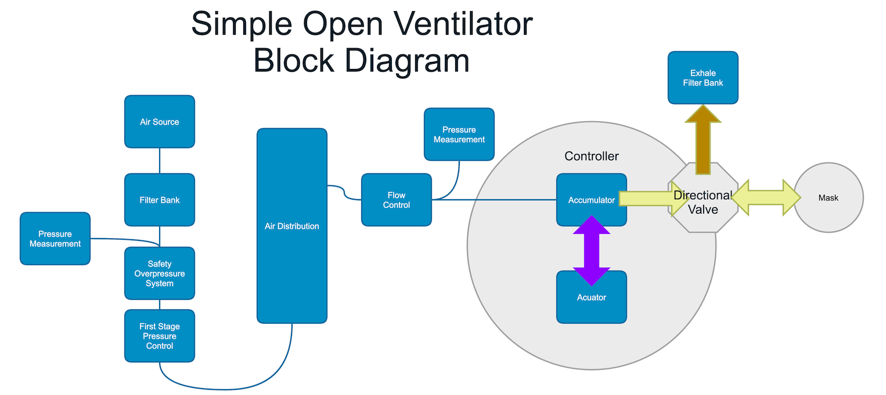

# Overall System Design
**System Diagram** 

As many parts from HD as possible

Air Pressure Delivery
* \- Manometer -- Pressure control Vale
* \- Pressure Control Valve
* \- Over Pressure Relief Valve
* \- Distribution System
* \- Individual tap
* \- Ambubag compressor
* \- Exhale Filter

# [Air Pressure Delivery](AirPressureDelivery/README.md)
We need air pressure to run the system and to provide venturi for exhale filtering.

# [Low Pressure Manometer](LowPressureManometer/README.md)
Critical Enabling design element, without this very simple measurement tool, you are just guessing. Measurements are taken with yardstick / meter stick. We can measure .47mmHg with a 1/4" or .37mmHg with 0.5cm. This is because H2O is much less dense than Mercury (Hg).

# [Pressure Control Valve](PressureControlValve/README.md)
Responsible for the overall system pressure regulation. Simple design based on gravity and a leaky regulator. *Still working to make it simpler*

# [Pressure Relief Valve](PressureRelief/README.md)
Responsible for overpressure protection. Fails in the OPEN position, meaning entire system pressure drops to ambient. Assumes a critical failure requires immediate attention. *Testing underway*
