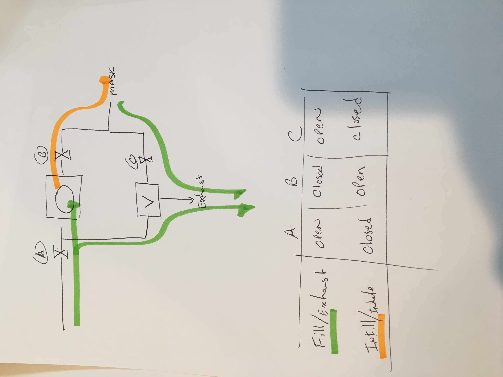

# [Ventilator Station](Ventilator/README.md)

* \- *[Tidal Air Measurement and Delivery](Ventilator/TidalAirIN/README.md)*
      **Recieved Ambu+ bag in mail, Discovery TODO: lots**

* \- *[Respiration Rate](Ventilator/RespirationRate/README.md)*
      **RC bi-stable multi-vibrator with Relays and solenoids**

* \- *[Tidal Air Removal](Ventilator/TidalAirOUT/README.md)*
      **Venturi Effect**

* \- *[Tidal Air Filtration](Ventilator/TidalAirFilter/README.md)*
      **Filter in a box with UV light**

# Actuator
Moving on to the squishing tool. We are going to use an ambu+ (accumulator) approach for the near term.

# Ambu Valve Schematic

# Flow Diagram

# System is gravity and pressure based.
the accumulator is put between two boards that are hinged on the other end.
Bags of beans (1-lbs/bag) are put on top of the upper board above the accumulator to provide constant force.

There is a small 2x2 board that provides the stop to keep the accumulator from being flattened. The max inflation is provided by a stop to keep the pac-man from opening too far.

# Tidal Volume
Adjusted by limiting the maximum opening (translation) of the pac-man mouth.

# Fill Rate
Adjusted with needle / globe valve for accumulator inflation speed.

# TODO: solenoid
Getting the solenoid working.
